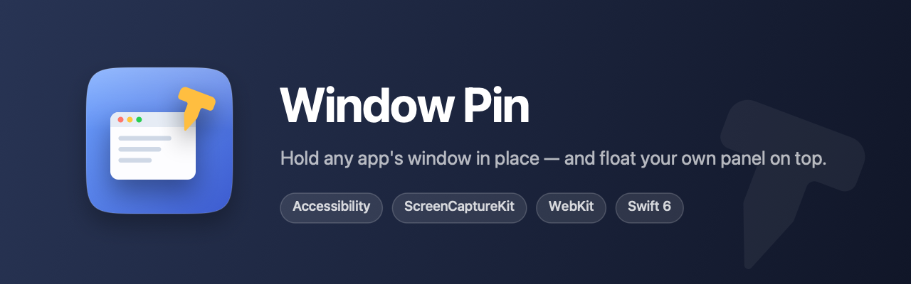
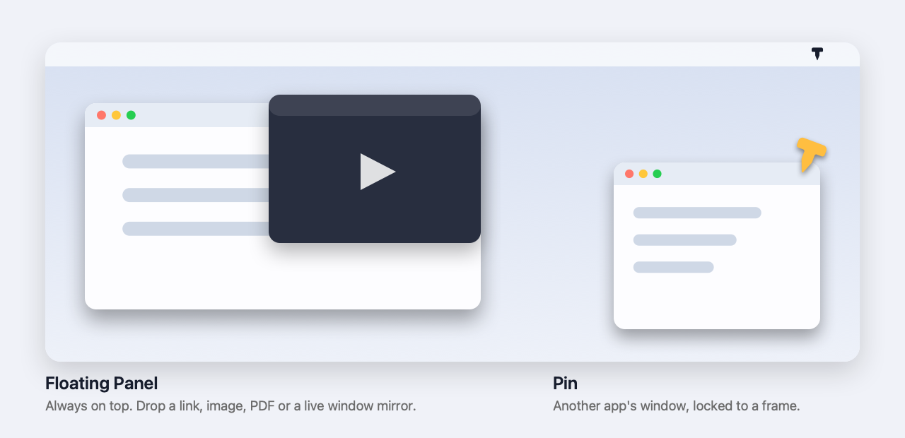

<p align="center">
  
</p>

A macOS menu bar utility with two independent halves:

**Pin** — holds another application's window at a fixed position and size. Put a
Chrome window in the bottom-right corner at 420 × 700, pin it, and it stays there
while you work in VS Code, Terminal or Finder. Uses the Accessibility API.

**Floating Panel** — an always-on-top box you drop things into. Drop a link and
it opens as a real, interactive web page you can click and type in; drop an
image, PDF, video or text and it appears inside; or mirror any application's
window live. Uses WebKit and ScreenCaptureKit.

The two halves need different permissions and neither blocks the other: the
panel works without Accessibility, and pinning works without Screen Recording.

<p align="center">
  
</p>

Built with Swift 6 and SwiftUI/AppKit, public APIs only.

---

## Requirements

- macOS 14.0 or later
- Xcode 16 or later (Swift 6 toolchain)

## Build and run

```bash
make app            # builds build/WindowPin.app
open build/WindowPin.app
```

`make run` does both. `make logs` streams the app's debug output.

`make assets` redraws the app icon and the images above from
`Scripts/make-assets.swift` — vector CoreGraphics, no binary source art. The
pin comes from `Sources/WindowPin/Utilities/PinGlyph.swift`, the same path the
menu bar draws, so the icon and the status item cannot drift apart.

The app has no Dock icon — it lives in the menu bar as a pin symbol.

### Opening in Xcode

Open `Package.swift` in Xcode. `swift build` compiles the code, but running from
Xcode gives you a bare executable without an app bundle, and macOS only grants
Accessibility permission to a **signed application bundle**. Use
`./Scripts/build-app.sh` and launch the resulting `.app` for anything involving
real windows.

### Signing and the permission reset

`Scripts/build-app.sh` ad-hoc signs by default. Ad-hoc signatures are keyed to
the binary's hash, so **every rebuild looks like a new app to macOS** and you
have to remove and re-add Window Pin in Accessibility settings.

If you have a Developer ID or Apple Development certificate, use it and the
permission sticks across rebuilds:

```bash
CODESIGN_IDENTITY="Apple Development: you@example.com (TEAMID)" make app
```

Other knobs: `CONFIGURATION=debug`, `UNIVERSAL=1` (arm64 + x86_64).

## First launch

Move the app into `Applications` before opening it. macOS runs a quarantined app
from a randomised read-only copy until it is moved out of Downloads, and because
that path changes on every launch, permissions granted there are attached to a
location that will not exist next time. If it does get opened from Downloads,
Window Pin offers to move itself and reopen from the right place.

There is no Dock icon — the app is the pin in the menu bar, and it says so once
on first launch. Opening it again while it is already running just hands over to
the copy that is running.

## Granting Accessibility access

On first launch the app shows the permission screen and prompts once. Then:

**System Settings → Privacy & Security → Accessibility → enable Window Pin**

The app polls once a second while permission is missing and stops polling the
moment it is granted — it never re-prompts in a loop.

## Using it

1. Click the pin in the menu bar.
2. Pick a window from the list (app name, title, size, position; hover a row for
   PID and window number).
3. Move and resize it however you like, or use the presets.
4. Click **Pin Window**.
5. The window now holds that frame. Move it and it snaps back.
6. Click **Unpin** to stop. The window stays wherever it currently is.

**Presets.** Position is a row of screen thumbnails — click the one showing
where you want the window: the four corners or centred. Sizes: 25% / 33% / 50%
of the display width (full usable height), Portrait (420 × 700), and Custom
(type your own width and height). Choosing a size without a position resizes the window
where it already sits. All frames are computed from `NSScreen.visibleFrame`, so
the menu bar and Dock are respected automatically.

**Detach Controller** opens the same controls in a floating panel that does not
close when you click another app — handy while arranging windows.

## Using the floating panel

Menu bar icon → **Floating Panel → Open**. The panel stays above every other
window, on every Space.

Drop into it:

| Dropped | Shown as |
|---|---|
| Image (png, jpg, heic, gif, …) | scaled image |
| PDF | PDFKit viewer, scroll and zoom |
| Video / audio (mp4, mov, mp3, …) | AVKit player with transport controls |
| Selected text | scrollable, selectable note |
| A link or browser tab | **interactive web page** |

You can also just type in the address bar — a URL, a bare hostname
(`youtube.com`), or search terms, which go to Google.

### Web page vs. mirror

Two ways to get a web page into the panel, and they trade off differently:

| | Web page (default) | Mirror a window (⧉ button) |
|---|---|---|
| Click, scroll, type | **yes** | no — pixels only |
| Your Chrome logins | no, separate cookie store | **yes**, it is the real window |
| Permission needed | none | Screen Recording |

Dropping a link opens the **web page**, because that is the one you can actually
use. If the page needs a session you are logged into in your real browser, hit
the **⧉ button** to mirror that window instead.

Mirroring is view-only for a measured reason, not an oversight: synthesised
mouse events are discarded by AppKit even with the captured app frontmost and
active, and even tagged with the target window number. Keyboard events *are*
delivered, so playback keys (space, ← →, f, m) do reach the mirrored window
without stealing focus, and clicking the mirror brings the real window forward.

**Why a dragged tab is only a link.** Dragging a Chrome tab gives the receiving
app a *URL*, not a reference to the window it came from — macOS has no drag
payload for "this window".

Mirroring needs **Screen Recording** permission (System Settings → Privacy &
Security → Screen Recording). Unlike Accessibility, macOS only re-reads this one
at process start, so quit and reopen Window Pin after enabling it — the panel
says so when it applies.

---

## How it works

```
Sources/WindowPin/
├── App/
│   ├── WindowPinApp.swift          MenuBarExtra scene
│   └── AppModel.swift              coordinates services, holds UI state
├── Models/
│   ├── WindowInfo.swift            a discoverable window
│   ├── PinnedWindow.swift          a pinned window + PinState
│   └── SnapPreset.swift            position and size presets
├── Services/
│   ├── AXWindowHandle.swift        the ONLY place AXUIElement is touched
│   ├── AccessibilityService.swift  permission state
│   ├── WindowDiscoveryService.swift  enumerates windows
│   ├── WindowObserverService.swift AXObserver + polling fallback
│   ├── WindowPinService.swift      holds the frame
│   ├── ScreenService.swift         displays and preset math
│   └── PinStore.swift              JSON persistence
├── Utilities/
│   ├── WindowGeometry.swift        the ONLY coordinate conversion
│   └── Log.swift
└── Views/                          no view calls an Accessibility API
```

### Coordinate systems

Two systems are in play and they disagree about `y`:

| | origin | y direction |
|---|---|---|
| AppKit (`NSScreen.frame`) | bottom-left of primary display | up |
| Accessibility (`kAXPositionAttribute`) | top-left of primary display | down |

Every frame in the app is in **AppKit** coordinates. `WindowGeometry` converts
at the single boundary where a frame is written to or read from a window. The
conversion is its own inverse (mirror across the primary display's `maxY`), which
also handles displays positioned above or to the left of the primary — those
legitimately have negative coordinates in both systems.

### Keeping a window in place

`AXObserver` notifications (`kAXWindowMovedNotification`,
`kAXWindowResizedNotification`, `kAXUIElementDestroyedNotification`) do the work.
They cost nothing while the window sits still. Three things make this behave:

- **Settle delay (160 ms).** Dragging a window emits a continuous stream of
  events. Acting on each one would fight the user's mouse; instead the window
  snaps back once they stop.
- **Frame adoption.** Some apps refuse the exact frame — Terminal quantises to
  character cells, Chrome enforces minimum sizes. After applying a frame the app
  reads back what the window actually settled at and adopts it as the pinned
  frame. Without this the two sides would correct each other forever.
- **Correction budget.** More than 6 corrections in a second means a fight, not
  a user action, so corrections pause for 2 seconds.

If `AXObserver` registration fails for an app, the window is polled every 400 ms
instead and the controller shows a timer icon so the difference is visible. When
observers work, a liveness check runs every 2 seconds to notice a window that
disappeared without a notification.

Measured against a helper app that moved and resized its own window every 1.5
seconds: the `AXObserver` path was used, every displacement was corrected, and
restore latency was 154–213 ms (dominated by the settle delay). Holding an idle
window cost 0.05 s of CPU over 20 s — about 0.25% of one core, most of it
process startup.

### Window identity

The live `AXUIElement` is the primary identity — it stays valid for the lifetime
of the window and starts returning errors when the window goes away. PID,
CoreGraphics window number and title are secondary metadata; titles change
constantly (browser tabs) so they are never the primary key.

Window numbers come from `CGWindowListCopyWindowInfo`, matched to Accessibility
windows by frame. That call returns pid, bounds and number without extra
permission — reading window *titles* from it would additionally require Screen
Recording access, so the app never asks it for titles.

When a pinned window closes or its app quits, the state becomes **Window
unavailable** and all repositioning stops.

### Multiple displays

The display holding the largest share of a window owns it. Its stable UUID
(`CGDisplayCreateUUIDFromDisplayID`, not the reassignable `CGDirectDisplayID`) is
stored with the pin. If that display is disconnected, the window is moved onto
the display that can hold it rather than being stranded in coordinates that no
longer exist.

### Persistence

`~/Library/Application Support/WindowPin/pin-configuration.json` holds the last
app, title, frame, display UUID, presets, and whether a pin was active.

On relaunch the app **never moves anything automatically**. If the previously
pinned window is found again it offers a *Previous pin found → Restore* banner;
until you click Restore, no other application's window is touched.

---

### Updating an installed copy

```
Services/UpdateService.swift     Sparkle wiring, gentle reminders
Scripts/build-app.sh             embeds + signs Sparkle, writes the feed keys
Scripts/release.sh               signs the artifact, writes and verifies appcast.xml
```

Installed copies keep themselves current. [Sparkle](https://sparkle-project.org)
checks `appcast.xml` on the download site once a day, because someone who
installed a menu bar utility months ago is never going to visit a download page
again. Installing is still the user's decision: replacing an app while someone
is in the middle of using it is not ours to make.

Every update is verified twice before it runs: an EdDSA signature made with a
private key held only in the release machine's login keychain, checked against
the `SUPublicEDKey` compiled into the copy already installed, and then the
Developer ID code signature. Nothing the download page could serve — including
a compromised download page — installs without the private key.

Two details are load-bearing and easy to get wrong:

- **`CFBundleVersion` must move with every release.** Sparkle compares that,
  not `CFBundleShortVersionString`. It used to be hardcoded to `1`, which would
  have made every release look identical to the one already installed and
  offered an update to nobody. `build-app.sh` now sets both from `VERSION`, and
  `release.sh` fails the release if they disagree.
- **The appcast points at a versioned filename**, `updates/WindowPin-1.2.3.zip`,
  never at the `WindowPin.zip` the download button uses. The appcast carries a
  signature of exact bytes, so a cache serving yesterday's zip against today's
  feed would fail the signature check and silently strand everyone. A URL that
  changes with every release cannot be stale.

How the question gets asked depends on whether the user is looking. This app has
no Dock icon and no window, so Sparkle's default — open an update window and
wait — puts a question behind whatever the user is doing when the find happens
in the background (Sparkle itself logs a warning about exactly this for
background apps). So `standardUserDriverShouldHandleShowingScheduledUpdate`
returns `immediateFocus`: a find while the user is already in front of the app
is left to Sparkle to present, and any other find is held, surfacing as a dot on
the menu bar icon and *Update to 1.2.3* in the controller. Clicking either hands
back to Sparkle, which then asks.

Not the Mac App Store: sandboxing is mandatory there, and it forbids both
controlling other applications' windows and posting synthetic key events — the
entire pinning half plus mirror key forwarding.

---

### The floating panel

```
Models/PanelContent.swift        what the panel is showing
Services/DropIntakeService.swift pasteboard -> PanelContent
Services/WebSession.swift        WKWebView + navigation state
Services/WindowMirrorService.swift  SCStream lifecycle
Services/MirrorInputForwarder.swift key forwarding, jump-to-window
Services/ScreenRecordingService.swift
Views/FloatingContentPanel.swift the NSPanel itself
Views/PanelRootView.swift        drop zone + content routing
Views/WebContentView.swift       web view + address bar
Views/MirrorRenderer.swift       IOSurface -> CALayer
```

Captured frames go straight from ScreenCaptureKit's `IOSurface` to a `CALayer`'s
`contents` — no per-frame image conversion, and no SwiftUI state involved, so
30 fps of video does not rebuild the view tree 30 times a second. Frames whose
`SCFrameStatus` is not `.complete` are dropped; presenting those idle/blank
frames would flicker the mirror.

Window candidates come from `SCShareableContent`, not the Accessibility API,
which is what lets the panel work with Screen Recording alone.

The web view sets a Safari version in its user agent. Without it sites decide
the panel is an ancient browser and serve a degraded page — YouTube refuses to
load live chat and shows an "update your browser" notice.

## Always-on-top: not possible for *other apps'* windows

macOS provides **no public API to change another application's window level**.
This was investigated before shipping:

- The Accessibility API exposes position, size, minimised, focused and a handful
  of actions. There is no window-level or "float" attribute, and no
  `AXUIElementSetAttributeValue` key that would raise a window above other apps
  permanently.
- `kAXRaiseAction` raises a window *once*, within its own application. The next
  click anywhere else buries it again.
- `NSWindow.level` only applies to windows this process owns.
- The CoreGraphics window-level functions that could do it (`CGSSetWindowLevel`
  and friends in SkyLight) are private SPI.

So this app does not claim always-on-top, and does not fake it by re-raising the
window on a timer — that flickers, steals focus, and fights the window server.
What it does guarantee is a **fixed position and size**, which is the actual MVP
requirement.

**This is why the floating panel exists.** A window we own *can* be set to
`.floating`, so mirroring the content into our own panel gives real
always-on-top behaviour — genuine picture-in-picture, rather than a hack on
someone else's window. The trade-off is that a mirror is view-only.

So: use **Pin** when you need to interact with the window and only want it to
stop moving. Use the **Floating Panel** when you need it visible above
everything and only need to watch it.

## Debugging

```bash
make logs
# or
log stream --level debug --predicate 'subsystem == "com.windowpin.app"'
```

Categories: `accessibility`, `discovery`, `pin`, `observer`, `screen`, `store`.

## Known limitations

- Ad-hoc signed builds lose Accessibility permission on every rebuild (see above).
- Apps that refuse a requested size get pinned at the nearest size they accept;
  the controller shows the adopted size.
- Minimised windows and non-standard windows (sheets, popovers, panels) are not
  listed — they are not independently positionable.
- Full-screen windows cannot be moved or resized by any app; take the window out
  of full screen first.
- One window is pinned at a time.
